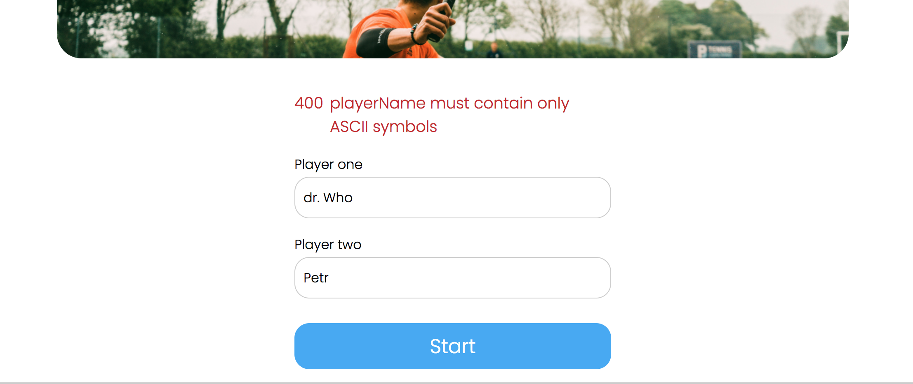
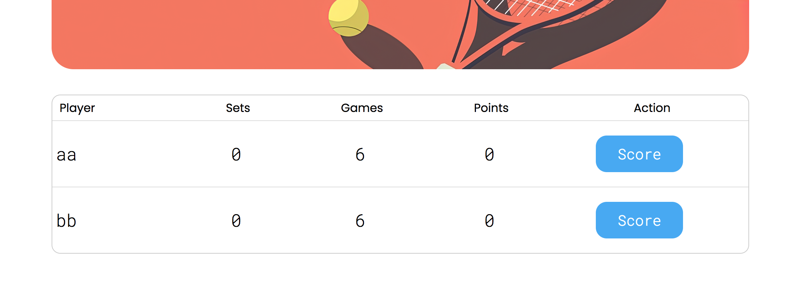
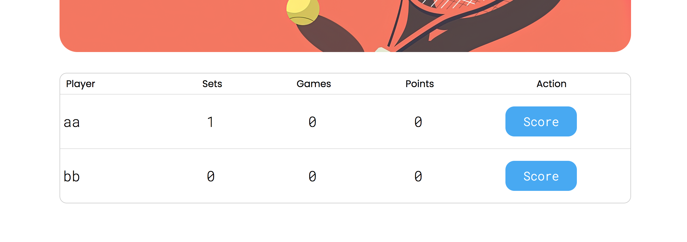
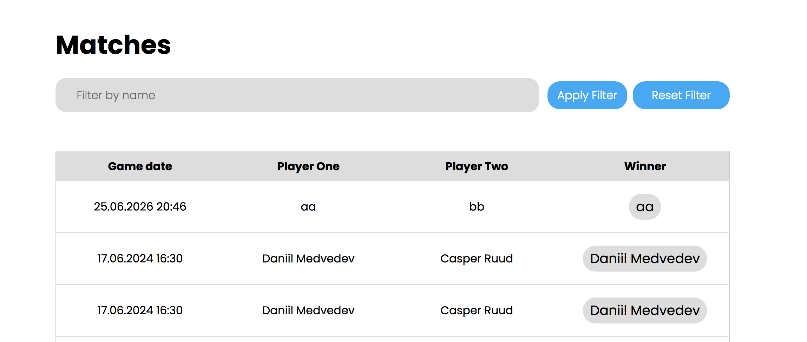
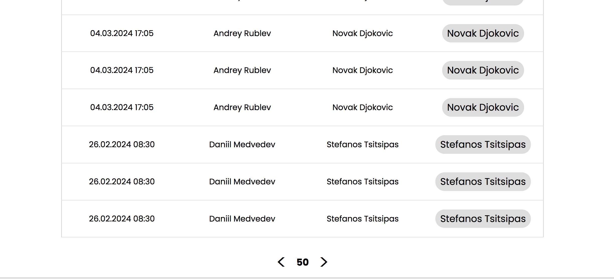

```text
Знаком ❗️ помечены критически важные замечания, а также места нарушения ТЗ.
```

## Функциональный обзор

- Неточное сообщение об ошибке



- Код ошибки не несёт никакой значимой информации для пользователя, поэтому можно его не отображать.

- ❗️Не отображаются очки в тай-брейке, хотя считаются верно





- Когда фильтр по имени не применён, можно не показывать кнопку сброса фильтра



- ❗️В пагинации на странице завершённых матчей отображается только одна страница.



Лучше сделать отображение текущей и +-2 страниц вокруг неё.

